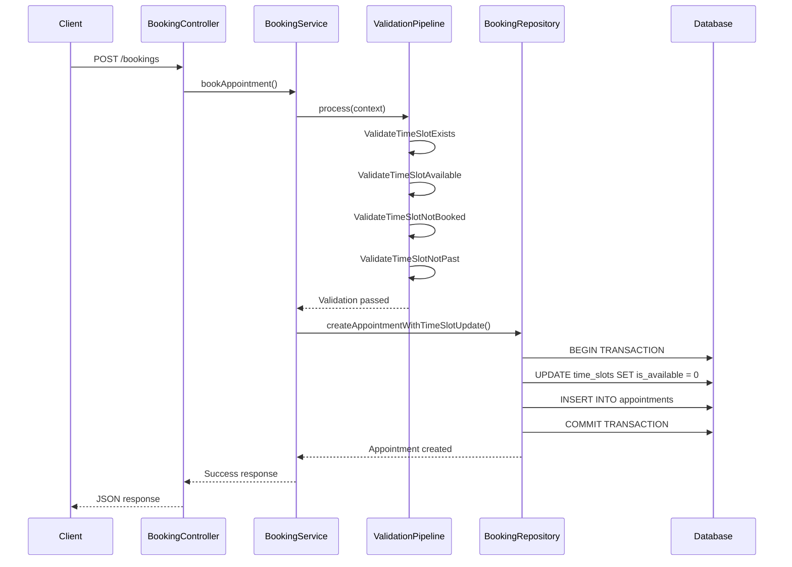
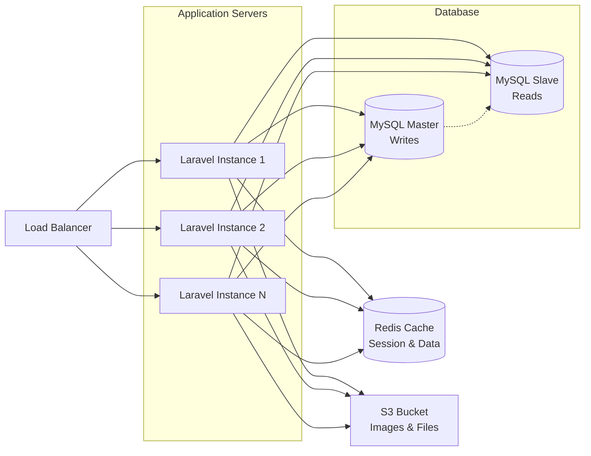

# 🏥 Appointment Booking System

A comprehensive clinic appointment booking system built with Laravel, implementing Domain-Driven Design (DDD) principles, SOLID principles, and modern design patterns.

## 🎯 System Features

### Core Functionality
- **Multi-Clinic Support**: Each clinic has multiple doctors
- **Doctor Time Slot Management**: Each doctor can define available time slots
- **Patient Booking**: Patients can search and book available slots
- **Exclusive Booking**: Each slot must be booked by only one patient
- **Dynamic Management**: New clinics and doctors can be added dynamically

### Architecture Highlights
- **Domain-Driven Design (DDD)** with clear domain boundaries
- **Service-Repository Pattern** for data access abstraction
- **Pipeline Pattern** for validation workflows
- **SOLID Principles** implementation throughout
- **RESTful API Design** with standardized responses

## 🏗️ Architecture Overview

### Domain Structure
```
app/Domains/
├── Clinic/         # Clinic management domain
├── Doctor/         # Doctor management domain
├── Patient/        # Patient management domain
├── Timeslot/       # Time slot management domain
└── Booking/        # Appointment booking domain
    ├── Contracts/      # Repository interfaces
    ├── Repositories/   # Data access implementations
    ├── Services/       # Business logic layer
    ├── Transformers/   # Response formatters
    ├── Pipelines/      # Validation
```

### Design Patterns Used

1. **Repository Pattern**: Data access abstraction
2. **Service Layer**: Business logic encapsulation
3. **Pipeline Pattern**: Validation chain processing
4. **Transformer**: Response formatting
5. **Dependency Injection**: Loose coupling

## 📊 Booking Operation Flow



## 🔒 Double Booking Prevention & Data Consistency

### 1. Database Level Constraints
```sql
-- Unique constraint on time_slot_id in appointments table
ALTER TABLE appointments ADD CONSTRAINT unique_timeslot UNIQUE (time_slot_id);
```

### 2. Transactional Integrity
```php
// Database transaction ensures atomicity
DB::transaction(function () use ($timeSlotId, $patientId) {
    $timeSlot = $this->timeslot->findOrFail($timeSlotId);
    $timeSlot->markAsUnavailable();
    $timeSlot->save();
    
    return $this->appointment->create([...]);
});
```

### 3. Pipeline Validation Chain
```php
// Multiple validation layers prevent conflicts
ValidateTimeSlotExists → 
ValidateTimeSlotAvailable → 
ValidateTimeSlotNotBooked → 
ValidateTimeSlotNotPast
```

### 4. Row-Level Locking
```php

$timeSlot = $this->timeslot->lockForUpdate()->findOrFail($timeSlotId);
```


## 🛠️ Installation & Setup

### Requirements
- PHP 8.1+
- Laravel 10+
- MySQL 8.0+
- Composer

### Installation Steps
```bash
# Clone repository
git clone <repository-url>
cd appointment-booking-system

# Install dependencies
composer install

# Environment setup
cp .env.example .env
php artisan key:generate

# Database setup
php artisan migrate

# Start development server
php artisan serve
```

### Database Schema
```bash
# Run migrations
php artisan migrate

# Tables created:
# - clinics
# - doctors
# - patients
# - time_slots
# - appointments
```

## 🧪 Testing

```bash
# Run tests
php artisan test

# Run with coverage
php artisan test --coverage
```


## 📈 Scalability Features

- **Domain Separation**: Independent scaling of business domains
- **Repository Abstraction**: Easy database technology switching
- **Pipeline Architecture**: Extensible validation workflows
- **Stateless Design**: Horizontal scaling capabilities
- **API-First Approach**: Multi-client support

## 🔐 Security Features

- **Request Validation**: Comprehensive input validation
- **Database Transactions**: Data integrity protection
- **Unique Constraints**: Prevent duplicate bookings
- **Soft Deletes**: Data recovery capabilities
- **Error Handling**: Handles errors

## 🚀 Scaling for Enterprise Level

### Proposed Architecture for Thousands of Users & Clinics



